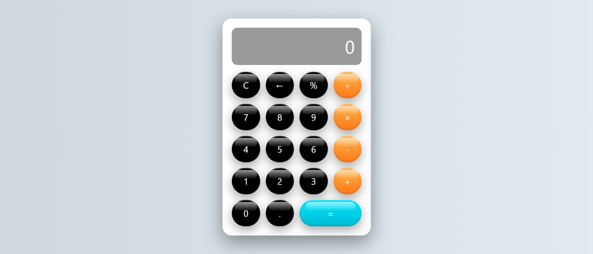

# Calculator Web App

A simple and responsive Calculator Web Application built using React.
It performs basic arithmetic operations with a clean and modern user interface.

---

# Live Link

https://k-calculator-app.netlify.app/

---

## Preview



---

## Features

- Perform basic operations: Addition, Subtraction, Multiplication, Division

- Clear (C) button to reset the calculation

- Delete (←) button to remove the last input

- Percentage (%) calculation

- Modern and responsive UI

---

## Technologies Used

- React

- JavaScript

- CSS

- Vite

---

## Installation

1. Clone the repository
```
git clone https://github.com/Khushbu696/Calculator.git
```

2. Navigate to the project folder
```
cd calculator
```

3. Install dependencies
```
npm install
```

4. Run the project
```
npm run dev
```

---

## Project Purpose

This project was created to practice React fundamentals, component-based structure, and state management while building a functional calculator.